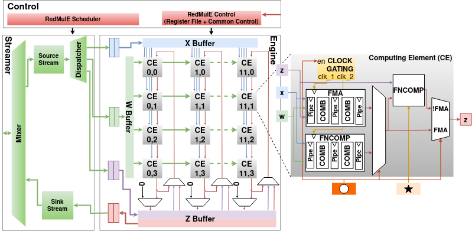
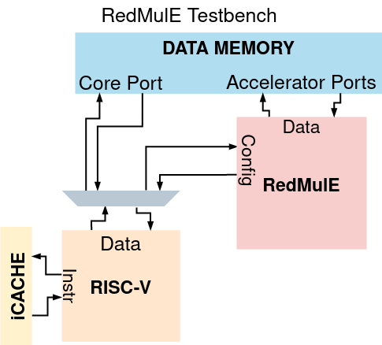

# RedMulE
RedMulE (**Red**uced-Precision Matrix **Mul**tiplication **E**ngine) is an open-source hardware accelerator based on the [HWPE](https://hwpe-doc.readthedocs.io/en/latest/index.html) template. It is designed to accelerate General Matrix-Matrix Operations (GEMM-Ops) on Floating-Point (FP) FP16 and FP8 input matrices. The keyword GEMM-Ops includes all the matrix operations of the kind **Z = (X op1 W) op2 Y**. The operators *op1* and *op2* can be any of those grouped in the following table:

|          Kernel           |  *op1*   |  *op2*  |           Res           |
| ------------------------- | -------- | ------- | ----------------------- |
|           GEMM            |    x     |    +    | *Z = (X x W) + Y*       |
| Maximum Critical Path     |    +     |   max   | *Z = max[(X + W), Y]*   |
| All-Pairs Shortest Paths  |    +     |   min   | *Z = min[(X + W), Y]*   |
| Maximum Reliability Path  |    x     |   max   | *Z = max[(X x W), Y]*   |
| Minimum Reliability Path  |    x     |   max   | *Z = min[(X x W), Y]*   |
| Minimum Spanning Tree     |   max    |   min   | *Z = min[max(X, W), Y]* |
| Maximum Capacity Tree     |   min    |   max   | *Z = max[min(X, W), Y]* |

To support GEMM-Ops with both FP8 and FP16 formats, RedMulE features input and output cast modules that allow for casting input matrices from FP8 to FP16 and the computed output matrix from FP16 to FP8. This allows for operating on larger internal precision guaranteeing enough accuracy during intermediate accumulations, for example during matrix multiplications.

## License and Citation
RedMulE is an open-source project and, wherever not explicitly stated, all hardware sources
are licensed under the SolderPad Hardware License Version 0.51, and all software sources
are licensed under the Apache License Version 2.0.
If you want to use RedMulE for academic purposes, please cite it as:

```
@INPROCEEDINGS{9774759,
  author={Tortorella, Yvan and Bertaccini, Luca and Rossi, Davide and Benini, Luca and Conti, Francesco},
  booktitle={2022 Design, Automation & Test in Europe Conference & Exhibition (DATE)}, 
  title={RedMulE: A Compact FP16 Matrix-Multiplication Accelerator for Adaptive Deep Learning on RISC-V-Based Ultra-Low-Power SoCs}, 
  year={2022},
  pages={1099-1102},
  doi={10.23919/DATE54114.2022.9774759}
}
```

See you, space cowboy!

## Hardware Architecture
RedMulE is fully parametric and based on a 2-Dimensional array (*Engine*) of Computing Elements (CE) that operate in lock-step. The overall architecture is shown in the figure below.



RedMulE's *Engine* features a parametric number of CEs, that can be decided throught the *ARRAY_WIDTH* and *ARRAY_HEIGHT* parameters, and a parametric number of Pipeline Registers (*PIPE_REGS*) within each CE. The value of the *ARRAY_WIDTH* parameter is upper-bounded as it depends on the *ARRAY_HEIGHT* and the *PIPE_REGS* values. Its maximum value equals **ARRAY_HEIGHTxPIPE_REGS**, while the bitwidth of RedMulE's memory interface can be calculated as **ARRAY_HEIGHTx(PIPE_REGS+1)xnumbits(FP_FORMAT)**. *FP_FORMAT* corresponds always to the internal precision (FP16). For example, the default RedMulE configuration provides *ARRAY_HEIGHT*=4 and *PIPE_REGS*=3, resulting in a 256-bits memory port and in *ARRAY_WIDTH* $\le$ 12. Each CE contains a Fused Multiply-Add (FMA) and two FP Non Computation Operators (FNCOMP) to support all the GEMM-Ops grouped under the table above. The FMA and FNCOMP modules are adapted from the open-source [Transprecision Floating-Point Unit](https://github.com/openhwgroup/cvfpu).
RedMulE code is written in System Verilog and all its submodules are available under the `hw/rtl` folder. The `hw/rtl/redmule_pkg.sv` contains all the required parameters available to instantiate RedMulE.
RedMulE's dependencies are handled through [bender](https://github.com/pulp-platform/bender), but can also be managed through IPstools.

## RedMulE Golden Model

The RedMulE Golden Model is intended to generate Floating-Point (FP) input and resulting matrices for all the General Matrix-Matrix Operations (GEMM-Ops) supported by RedMulE. The folder contains two subfolders for FP16 and FP8 golden model generation. Each folder contains a `script` folder to generate the model for all the supported GEMM-Ops, i. e. :
* addmax: Z = max((X + W), Y)
* addmin: Z = min((X + W), Y)
* gemm  : Z = (X x W) + Y
* maxmin: Z = min(max(X, W), Y)
* minmax: Z = max(min(X, W), Y)
* mulmax: Z = max((X x W), Y)
* mulmin: Z = min((X x W), Y)

### Generating Models
The golden model makes use of Python3.6 virtual environment, Numpy and Pytorch. These modules have
to be installed if they are not already present. To simplify this procedure, the `golden-model` folder
contains a `setup-py.sh` that can be sourced to install all these modules, and to export the
required environment variables. Thus, the first step is to move into the `golden-model` folder and run:
```bash
source setup-py.sh
```

This will install a Python3.6 virtual environment under the `venv` folder.
The RedMulE Golden Model contains a `Makefile` that allows for easy golden matrices generation.
The parameters needed by such a Makefile are the following:
* M     : number of rows of the X, Y, and Z matrices;
* N     : number of columns of the X matrix, and as a consequence the number of rows of the W one;
* K     : number of columns of the W, Y, and Z matrices;
* fp_fmt: FP format, this can be FP16 or FP8;
* SW    : path to a folder to which it is desired to export the golden data as header files.

For example, if you want to generate the golden model for the MINMAX operation, using FP8 encoding,
under a local `inc` directory and using [96x64]*[64x64] matrices, first create the `inc` folder (`mkdir inc`) and then run:
```
make clean minmax M=96 N=64 K=64 fp_fmt=FP8 SW=$(pwd)/inc
```

Each execution of the RedMulE Golden Model also generates data in `.txt` format under the `golden-model`. The example showed above will generate a `minmax` folder containing a `txt` folder with
the generated matrices.

## RedMulE Testbench
RedMulE offers a complete testing environment for under the `hw/tb` folder. The `hw/tb/redmule-tb.sv` features a RedMulE instance, an Ibex core as a controller and programmer, and dummy memories to simulate software stack, data-memory and instruction memory, as shown in the picture below.



The structure of the testbench is based on the [hwpe-tb](https://github.com/pulp-platform/hwpe-tb) example.

### Software Setup
The software required to use the testbench is located under the `sw` folder. It contains:
* archi_redmule.h: a software description of the RedMulE architecture (like the register-file map, the supported FP format, ...);
* hal_redmule.h: a Hardware Abstraction Layer (HAL) containg a few APIs to program RedMulE and start its operation.
* redmule.c: the SW test executed by the Ibex core;

### Getting Started
If you are working on ETH Lagrev serversm sourcing the `setup.sh` should suffice to export the path to the bender, to the SDK, and to the toolchain. Otherwise, it ise recommanded to install a riscv [toolchain](https://github.com/pulp-platform/pulp-riscv-gnu-toolchain) and export the following environment varibles:
```bash
export PATH=/absolute/path/to/riscv/toolchain/bin:$PATH
export PULP_RISCV_GCC_TOOLCHAIN=/absolute/path/to/riscv/toolchain
export PULP_CC=/your/riscv/gcc
export PULP_LD=/your/riscv/gcc
export PATH=/absolute/path/to/gcc/bin:$PATH
```
Install bender by executing:
```bash
make bender
```
Bender installation is not mandatory. If any bender version is already installed, it is just needed to add the absolute path to the `bender` binary to the `PATH` variable. 

Clone the dependencies and generate the compilation script by running:
```bash
make update-ips
```

Build the hardware:
```bash
make build-hw
```
The last two steps can be done using IPstools instead of bender by running the make commands with `ipstools=1` (e.g. `make update-ips ipstools=1`).

### Run the test

Clone the pulp-sdk (if not already cloned somewhere else):
```bash
make sdk
```
Source the relative setup script:
```bash
source /absolute-path-to-the/pulp-sdk/configs/pulp-open.sh
```
The previouse `make` command clones the pulp-sdk under `sw`, so it is possible to:
```bash
source sw/pulp-sdk/configs/pulp-open.sh
```
Now, it is possible to execute the test:
```bash
make all
make run (gui=1 to open the Questasim Graphic User Interface)
```
It is possible to run the test introducing a parametric probability of stall by explicitly passing the `P_STALL` parameter while running the test (`P_STALL=0.1` means a stall probability of the 10%). 

### Golden Model Generation
It is possible to generate fresh golden models directly from the `redmule` folder. The parameters that can be used to generate different golden models are the following:
* OP: this can be any of the GEMM-Ops supported by RedMulE (refer to the redmule-golde-model section);
* fp_fmt: FP format fot the generated matrices, it can either be FP16 or FP8;
* M, N, K: number of rows and columns of the generated matrices (refer to the redmule-golde-model section);
* SW: path to a folder to which it is desired to export the golden data as header files.

By default, the Makefile generates FP16 matrices for a GEMM operation, with M=12, N=16, K=16, and exports the generated header files under `sw/inc`. To generate a different golden model, let's say, for a MINMAX operation, using FP8 encoding and operating on [96x64]*[64x64] matrices, and exporting the header files under the `./inc` path, create the `inc` dir (`mkdir inc`) and then run:
```bash
make golden OP=minmax SW=$(pwd) M=96 N=64 K=64 fp_fmt=FP8
```
By removing the `SW=$(pwd)`, the same golden model is generated under `sw/inc`.
